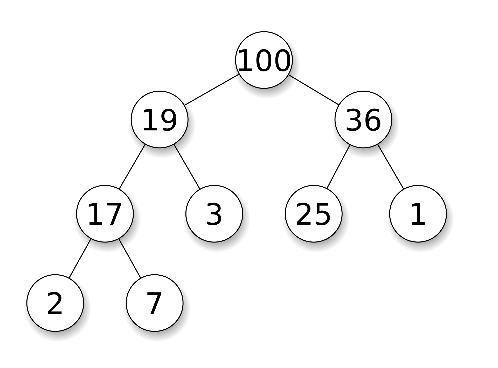
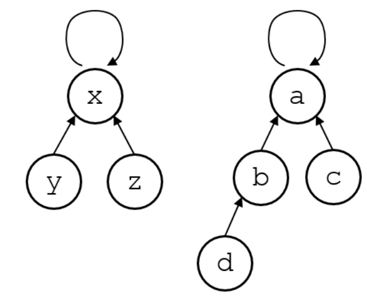
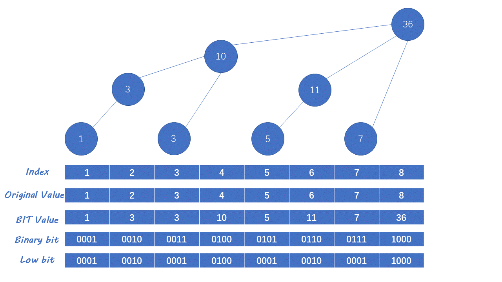
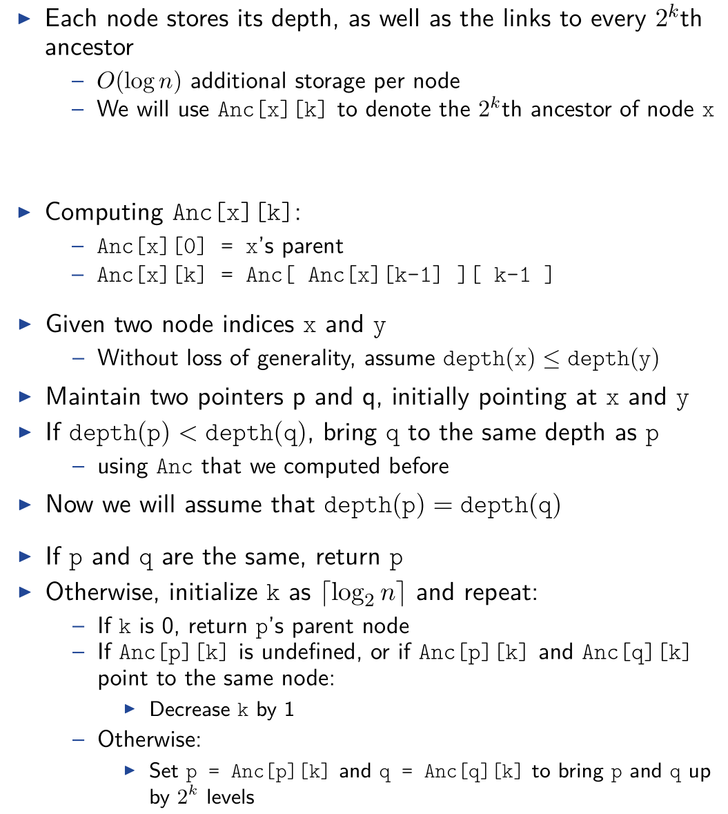

# Data Structures

## Stack and Queue

### Stack

* Last in, first out(LIFO)
* Supports three constant-time operations
  * Push(x): inserts x into the stack
  * Pop(): removes the newest item
  * Top(): returns the newest item

### Queue

* First in, first out (FIFO)
* Supports three constant-time operations
  * Enqueue(x): inserts x into the queue
  * Dequeue(): removes the oldest item
  * Front(): returns the oldest item

**Example：**

```cpp
#include <iostream>
#include <stack>
#include <queue>

using namespace ::std;

int main()
{
    stack<int> s;
    s.push(1);
    s.push(2);
    s.push(3);
    cout << s.top() << endl;
    s.pop();
    queue<int> q;
    q.push(1);
    q.push(2);
    q.push(3);
    cout << q.front() << endl;
    q.pop();
    return 0;
}
```

## Heap and Priority Queue

### Priority Queue

* Each element in a PQ has a priority value
* Three operations:
  * Insert(x, p): inserts x into the PQ, whose priority is p
  * RemoveTop(): removes the element with the highest priority
  * Top(): returns the element with the highest priority

### Heap

* Complete binary tree with the heap property:
  * The value of a node $\geq$ values of its children
* The root node has the maximum value
* Inserting/removing a node can be done in $O(\log n)$ time without breaking the heap property



* Given a node k easy to compute the indices of its parent and children

  * Parent node: $\lfloor \frac{k}{2} \rfloor $
  * Children: $2k,2k+1$

* Inserting a Node

  1. Make a new node in the last level, as far left as possible

  2. If the new node breaks the heap property, swap with its parent node

  3. Repeat 2 until all conflicts are resolved

  4. Running time = tree height = $O(\log n)$

     ```cpp
     void InsertNode(int v){
         H[++n] = v;
         for(int k = n; k > 1; k /= 2){
             if(H[k] > H[k/2])
                 swap(H[k], H[k/2]);
             else
                 break;
         }
     }
     ```

* Deleting the Root Node

  1. Remove the root, and bring the last node
  2. If the root breaks the heap property, look at its children and swap it with the larger one
  3. Repeat 2 until all conflicts are resolved

## Union-Find Structure

* Used to store disjoint sets
* Can support two types of operations efficiently
  * $Find(x)$ : returns the “representative” of the set that $x$ belongs
  * $Union(x, y)$ : merges two sets that contain $x$ and $y$
* Both operations can be done in (essentially) constant time

Main idea: represent each set by a rooted tree

* Every node maintains a link to its parent

* A root node is the “representative” of the corresponding set

  

```cpp
class UF
{
private:
    vector<int> L;

public:
    UF(int n) : L(n)
    {
        for (int i = 0; i < n; i++)
            L[i] = i;
    }
    int Find(int x)
    {
        return x == L[x] ? x : L[x] = Find(L[x]);
    }
    void Union(int x, int y)
    {
        int rootx = Find(x), rooty = Find(y);
        if (rootx == rooty)
            return;
        L[rootx] = rooty;
    }
};
```

## Binary Search Tree

A binary tree with the following property: for each node

* value of $v$ $\geq$  values in $v$'s left subtree
* value of $v$ $\leq$  dvalues in $v$'s right subtree


Supports three operations

* $Insert(x)$: inserts a node with value $x$
* $Delete(x)$: deletes a node with value $x$, if there is any
* $Find(x)$: returns the node with value $x$, if there is any

Many extensions are possible

* $Count(x)$: counts the number of nodes with value less than or equal to $x$
* $GetNext(x)$: returns the smallest node with value $\geq x$ 

## Fenwick Tree



```cpp
int t1[MAXN], t2[MAXN], n;

// O(n)建树
void init() {
  for (int i = 1; i <= n; ++i) {
    t[i] += a[i];
    int j = i + lowbit(i);
    if (j <= n) t[j] += t[i];
  }
}

inline int lowbit(int x) { return x & (-x); }

void add(int k, int v) {
  int v1 = k * v;
  while (k <= n) {
    t1[k] += v, t2[k] += v1;
    k += lowbit(k);
  }
}

int getsum(int *t, int k) {
  int ret = 0;
  while (k) {
    ret += t[k];
    k -= lowbit(k);
  }
  return ret;
}

void add1(int l, int r, int v) {
  add(l, v), add(r + 1, -v);  // 将区间加差分为两个前缀加
}

long long getsum1(int l, int r) {
  return (r + 1ll) * getsum(t1, r) - 1ll * l * getsum(t1, l - 1) -
         (getsum(t2, r) - getsum(t2, l - 1));
}
```

## Lowest Common Ancestor

* Input: a rooted tree and a bunch of node pairs

* Output: lowest (deepest) common ancestors of the given pairs of nodes



