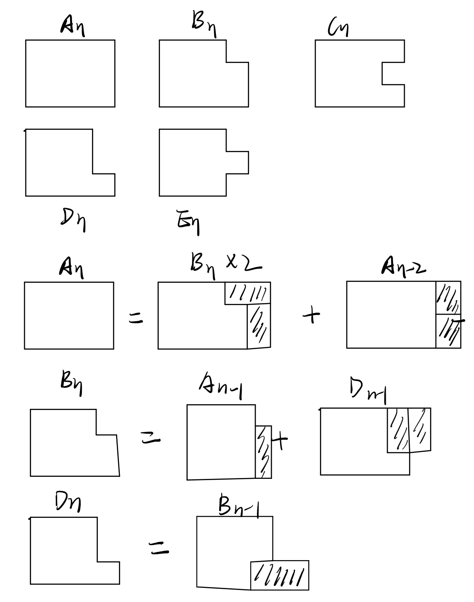

# Dynamic Programming

Dynamic Programming :  method for solving complex problems by breaking them down into simpler subproblems.

Steps for Solving DP Problems:

1. Define subproblems
2. Write down the recurrence that relates subproblems
3. Recognize and solve the base cases

## 1-dimensional DP 

Problem: given n, find the number of different ways to write n as the sum of 1, 3, 4

* Define subproblems : Let $D_n$ be the number of ways to write $n$ as the sum of 1, 3, 4

* Find the recurrence

  * Consider one possible solution $n = x_1 + \dots + x_m$

  * If $x_m = 1$, the rest of the terms must sum to $n-1$

  * Thus, the number of sums that end with $x_m=1$ is equal to $D_{n-1}$

  * Take other case into account ($x_m=3,x_m=4$)

  * Recurrence is then
    $$
    D_n = D_{n-1} + D_{n-3} + D_{n-4}
    $$

* Solve the base cases

  * $D_0=1$
  * $D_n=0$ for all negative $n$
  * Alternatively, can set: $D_0=D_1=D_2=1$ and $D_3=2$

  ```cpp
  D[0]=D[1]=D[2]=1;
  D[3]=2;
  for(i = 4; i <= n; i++)
      D[i] = D[i-1] + D[i-3] + D[i-4];
  ```

Tri Tiling Problem : Given n, find the number of ways to fill a 3 × n board with dominoes

* Define subproblems : Define $D_n$ as the number of ways to tile a $3\times n$ board
* Find recurrence


$$
A[n] = 4A[n-2] + A[n-4]
$$

* Solve the base cases : $A[0]=1,A[2]=3$

## 2-dimensional DP

Problem : given two strings $x$ and $y$, find the longest common subsequence (LCS) and print its length.

* Define subproblems : Let $D_{ij}$ be the length of the LCS of $x_{1\dots i}$ and $y_{1\dots j}$

* Find the recurrence

  * if $x_i = y_j$, the both contribute to the LCS
    $$
    D_{ij} = D_{i-1,j-1}+1
    $$

  * Otherwise, either $x_i$ or $y_j$ does not contribute to the LCS, so one can be dropped
    $$
    D_{ij}=\max\{D_{i-1,j},D_{i,j-1}\}
    $$

* Solve the base cases : $D_{i0}=D_{0j}=0$

```cpp
for(i = 0; i <= n; i++) D[i][0] = 0;
for(j = 0; j <= m; j++) D[0][j] = 0;
for(i = 1; i <= n; i++) {
    for(j = 1; j <= m; j++) {
        if(x[i] == y[j])
            D[i][j] = D[i-1][j-1] + 1;
        else
            D[i][j] = max(D[i-1][j], D[i][j-1]);
    }
}
```

## Interval DP

Problem : given a string $x=x_{1\dots n}$ find the minimum number of characters that need to be inserted to make it palindrome

* Define subproblems : Let $D_{ij}$ be the minmum number of characters that need to be inserted to make $x_{i\dots j}$ into a palindrome

* Find the recurrence

  * Consider a shortest palindrome $y_{1\dots k}$ containing $x_{i\dots j}$

  * Either $y_1 = x_i$ or $y_k=x_j$

  * $y_{2\dots k-1}$ is then an optimal solution for $x_{i+1\dots j}$ or $x_{i\dots j-1}$ or $x_{i+1\dots j-1}$
    $$
    D_{ij} = 
    \left\{\begin{matrix}
    1+\min\{D_{i+1,j},D_{i,j-1}\} & x_i \neq x_j\\
    D_{i+1,j-1} & x_i = x_j
    \end{matrix}\right.
    $$

* Solve the base cases : $D_{ii}=D_{i,i-1}=0$ for all $i$

```cpp
// fill in base cases here
for(t = 2; t <= n; t++)
    for(i = 1, j = t; j <= n; i++, j++)
        if(x[i] == x[j])
            D[i][j] = D[i+1][j-1];
        else
            D[i][j] = 1 + min(D[i-1][j],D[i][j-1]);
```

## Tree DP

Problem : given a tree, color nodes black as many as possible without coloring two adjacent nodes

* Subproblems:

  * First, we arbitrarily decide the root node $r$
  * $B_v$ : the optimal solution for a subtree having $v$ as the root, where we color $v$ black
  * $W_v$ : the optimal solution for a subtree having $v$ as the root, where we don't color $v$ 

* Find the recurrence

  * Crucial observation: once $v$’s color is determined, subtrees can be solved independently

  * If $v$ is colored, its children must not be colored
    $$
    B_v = 1+\sum_{u\in \text{children}(v)W_u}
    $$

  * If $v$ is not colored, its children can have any color
    $$
    W_v = 1 + \sum_{u\in \text{children}(v)}\max\{B_u, W_u\}
    $$

* Base cases: leaf nodes

## Subset DP

Problem : given a weighted graph with $n$ nodes, find the shortest path that visits every node exactly once

* Define subproblems :

  * $D_{S,v}$ : the length of the optimal path that visits every node in the set $S$ exactly once and ends at $v$

* Find the recurrence

  * Consider a path that visits all nodes in S exactly once and
    ends at $v$

  * Right before arriving $v$, the path comes from some u in
    $S − \{v\}$

  * And that subpath has to be the optimal one that covers
    $S − \{v\}$, ending at $u$

  * We just try all possible candidates for u
    $$
    D_{S,v} = \min_{u\in S-\{v\}}(D_{S-\{v\},u} + cost(u,v))
    $$

* Base cases
  $$
  D_{\{v\},v}=0
  $$

