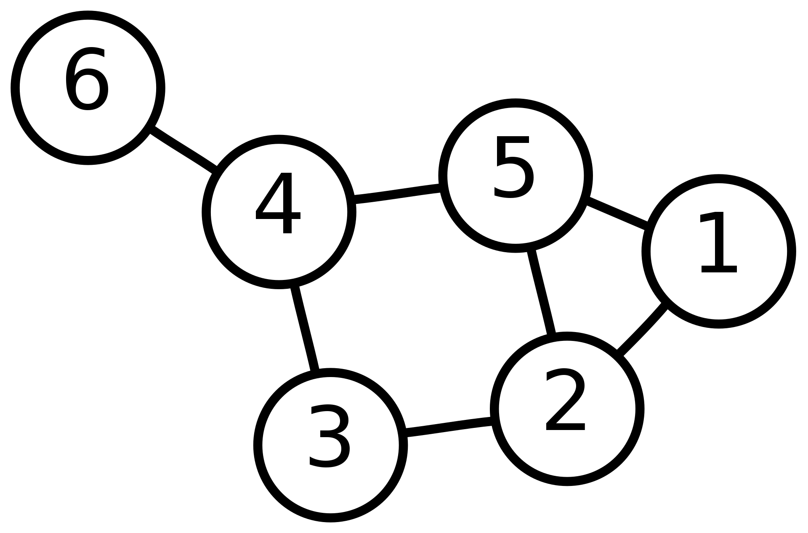
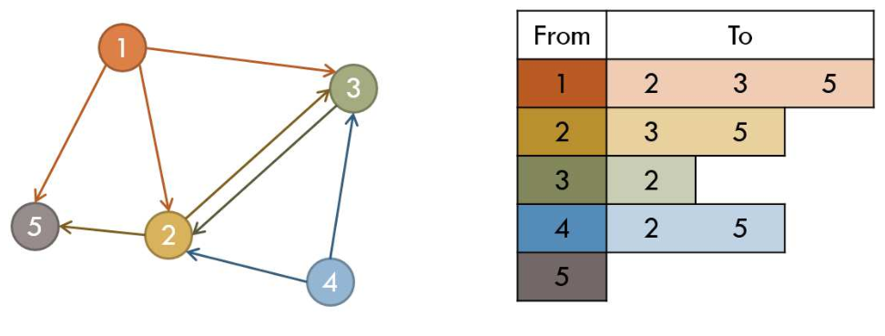
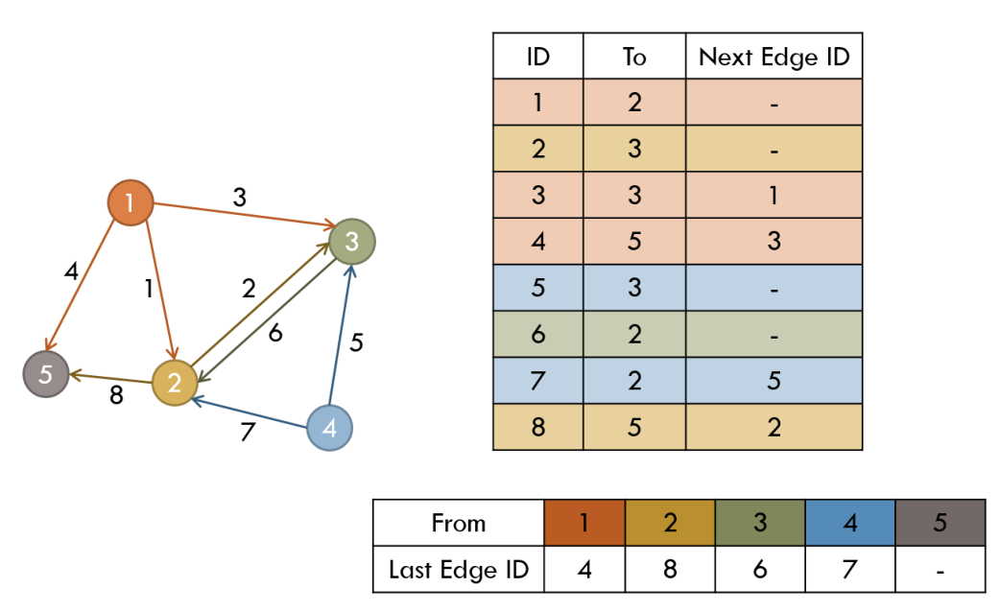
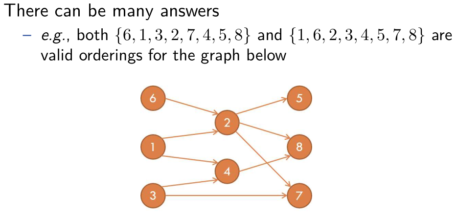
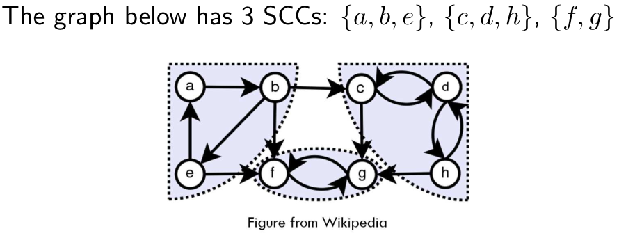

# Basic Graph Algorithms

## Graphs

* An abstract way of representing connectivity using nodes (also called vertices) and edges.



## Adjacency Matrix and Adjacency List

### Storing Graphs

* Need to store both the set of nodes V and the set of edges E
  * Nodes can be stored in an array
  * Edges must be stored in some other way
* Want to support operations such as:
  * Retrieving all edges incident to a particular node
  * Testing if given two nodes are directly connected
* Use either adjacency matrix or adjacency list to store the edges

### Adjacency Matrix

* An easy way to store connectivity information
  * Checking if two nodes are directly connected: $O(1)$ time
* Make an $n\times n$ matrix $A$
  * $a_{ij}=1$ if there is an edge from $i$ to $j$
  * $a_{ij}=0$ otherwise
* Uses $\Theta(n^2)$ memory
  * Onlu use when $n$ is less than a few thousands and when the graph is dense

### Adjacency List

* Each node has a list of outgoing edges from it

  * Easy to iterate over edges incident to a certain node
  * The lists have variable lengths
  * Space usage: $\Theta(n+m)$

  

### Implementing Adjacency List

1. Using linked lists
   * Too much memory/time overhead
   * Using dynamic allocated memory or pointers is bad
2. Using an array of vectors
   * Easier to code, no bad memory issues
   * But very slow
3. Using arrays (!)
   * Assuming the total number of edges is known
   * Very fast and memory-efficient



* Have two arrays $E$ of size $m$ and $LE$ of size $n$

  * $E$ contains the edges
  * $LE$ contains the starting pointers of the edge lists

* Initialize $LE[i]=-1$ for all i

  * $LE[i]=0$ is also fine if the arrays are 1-indexed

* Inserting a new edge from $u$ to $v$ with $ID_{k}$

  ```cpp
  E[k].to = v;
  E[k].nextID = LE[u];
  LE[u] = k;
  ```

* Iterating over all edges starting at $u$

  ```cpp
  for(ID = LE[u]; ID != -1; ID = E[ID].nextID)
      // E[ID] is an edge starting from u
  ```

* Once built, it’s hard to modify the edges

  * The graph better be static!
  * But adding more edges is easy

## Special Graphs

### Tree

* A connected acyclic graph
* Most important type of special graphs
  * Many problems are easier to solve on trees
* Alternate equivalent definitions:
  * A connected graph with $n − 1$ edges
  * An acyclic graph with $n − 1$ edges
  * There is exactly one path between every pair of nodes
  * An acyclic graph but adding any edge results in a cycle
  * A connected graph but removing any edge disconnects it

Directed Acyclic Graph (DAG)

Bipartite Graph: Nodes can be separated into two groups S and T such that edges exist between S and T only (no edges within S or within T)

## Depth-First and Breadth-First Search

### Depth-First Search

$DFS(v)$ : visits all the nodes reachable from $v$ in depth-first order

* Mark $v$ as visited
* For each edge $v \rightarrow u$ :
  * If $u$ is not visited, call $DFS(u)$
* Use non-recursive version if recursion depth is too big (over a few thousands)
  * Replace recursive calls with a stack

### Breadth-First Search

$BFS(v)$: visits all the nodes reachable from $v$ in breadth-first order

* Initialize a queue $Q$
* Mark $v$ as visited and push it to $Q$
* While $Q$ is not empty:
  * Take the front element of $Q $and call it $w$
  * For each edge $w \rightarrow u$:
    * If $u$ is not visited, mark it as visited and push it to $Q$

## Topological Sort

* Input: a DAG $G=(V,E)$
* Output: an ordering of nodes such that for each edge $u\rightarrow v$, $u$ comes before $v$



### Method 1

* Any node without an incoming edge can be the first element
* After deciding the first node, remove outgoing edges from it
* Repeat!

Time complexity: $O(n^2+m)$

### Method 2

* Precompute the number of incoming edges $deg(v)$ for each node $v$
* Put all nodes $v$ with $deg(v)=0$ into a queue $Q$
* Repeat until $Q$ becomes empty:
  * Take $v$ from $Q$
  * For each edge $v \rightarrow u$:
    * Decrement $deg(u)$
    * If $deg(u)=0$, push $u$ into $Q$

Time complexity : $\Theta(n+m)$

## Eulerian Circuit

* Given an undirected graph G
* Want to find a sequence of nodes that visits every edge exactly once and comes back to the starting point
* Eulerian circuits exist if and only if
  * $G$ is connected
  * and each node has an even degree

### Constructive Proof of Existence

* Pick any node in G and walk randomly without using the same edge more than once
* Each node is of even degree, so when you enter a node, there will be an unused edge you exit through
  * Except at the starting point, at which you can get stuck
* When you get stuck, what you have is a cycle
  * Remove the cycle and repeat the process in each connected component
  * Glue the cycles together to finish!

### Related Problems

* Eulerian path: exists if and only if the graph is connected and the number of nodes with odd degree is 0 or 2.
* Hamiltonian path/cycle: a path/cycle that visits every node in the graph exactly once. Looks similar but very hard (still unsolved)!

## Minimum Spanning Tree (MST)

* Given an undirected weighted graph $G=(V,E)$
* Want to find a subset of $E$ with the minimum total weight that connects all the nodes into a tree

### Kruskal’s Algorithm

* Main idea: the edge $e^{\star}$ with the smallest weight has to be in the MST
* Simple proof :
  * Assume not. Take the MST $T$ that doesn’t contain $e^{\star}$.
  * Add $e^{\star}$ to $T$, which results in a cycle.
  * Remove the edge with the highest weight from the cycle.
    * The removed edge cannot be $e^{\star}$ since it has the smallest weight.
  * Now we have a better spanning tree than $T$
  * Contradiction!

* Another main idea: after an edge is chosen, the two nodes at the ends can be merged and considered as a single node (supernode)
* Pseudocode:
  * Sort the edges in increasing order of weight
  * Repeat until there is one supernode left:
    * Take the minimum weight edge $e^{\star}$
    * If $e^{\star}$ connects two different supernodes, then connect them and merge the supernodes
  * Otherwise, ignore $e^{\star}$ and try the next edeg

### Prim’s Algorithm

* Main idea:
  * Maintain a set $S$ that starts out with a single node $s$
  * Find the smallest weighted edge $e^{\star}=(u,v)$ that connects $u\in S$ and $v \notin S$
  * Add $e^{\star}$ to the MST, add $v$ to $S$
  * Repeat until $S=V$
* Differs from Kruskal’s in that we grow a single supernode $S$ instead of growing multiple ones at the same time
* Pseudocode :
  * Initialize $S:=\{s\}, D_v:=cost(s,v)$ for every $v$
    * If there is no edge between $s$ and $v$, $cost(s,v)=\infty$
  * Repeat until $S=V$ :
    * Find $v\notin S$ with smallest $D_v$
    * Use a priority queue or a simple linear search
  * Add $v$ to $S$, add $D_v$ to the total weight of the MST
  * For each edge $(v,w)$:
    * Update $D_w:=\min(D_w, cost(v,w))$
  * Can be modified to compute the actual MST along with the total weight

### Compare

Kruskal’s Algorithm

* Takes $O(m\log m)$ time
* Pretty easy to code
* Generally slower than Prim’s

Prim’s Algorithm

* Time complexity depends on the implementation:
  * Can be $O(n^2+m), O(m\log n),O(m+n\log n)$
* A bit trickier to code
* Generally faster than Kruskal’s

## Strongly Connected Components (SCC)

* Given a directed graph $G=(V,E)$
* A graph is strongly connected if all nodes are reachable from every single node in $V$
* Strongly connected components of $G$ are maximal strongly connected subgraphs of $G$



### Kosaraju’s Algorithm

* Initialize counter $c := 0$
* While not all nodes are labeled:
  * Choose an arbitrary unlabeled node $v$
  * Start DFS from $v$
    * Check the current node $x$ as visited
    * Recurse on all unvisited neighbors
    * After the DFS calls are finished, increment $c$ and set the label of $x$ as $c$
* Reverse the direction of all the edges
* For node $v$ with label $n,n−1,\dots,1$:
  * Find all reachable nodes from $v$ and group them as an SCC

* Running time $\Theta(n+m)$

